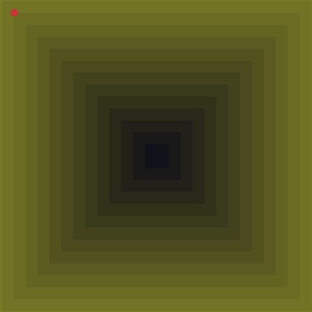
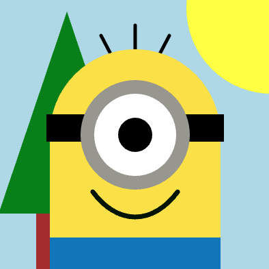
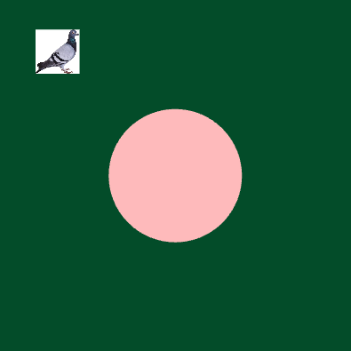
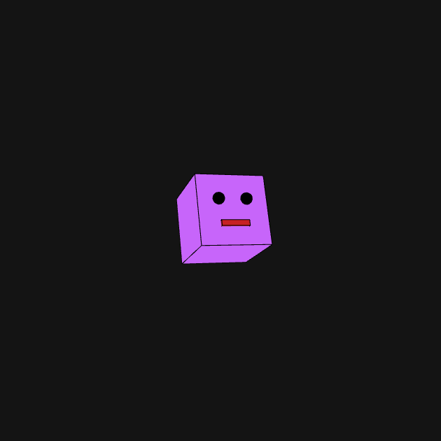
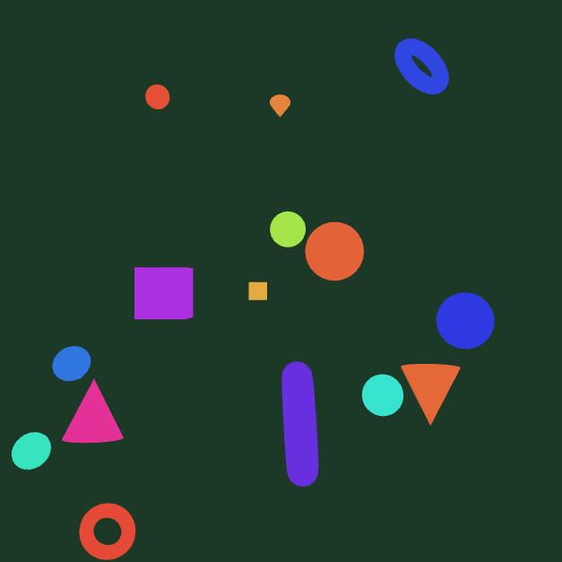

# CART 253 Prototyping

Agustin Maximo Lee

## Description

> This website shows off the work I've made throughout CART 253. Each project is in its own folder with a different idea, technique, or piece of creative code.

## Useful Links

> - [Course Website](https://agusmaxlee.github.io/CART253-Web_Project/)
> - [Reflective Journal](./journal.md)

## Challenges

### Hello, World!

#### Version Control Workflow

[View running prototype](./topics/version-control/version-control-workflow/) | [View code](./topics/version-control/version-control-workflow/)

### Instructions

#### Minion

[View running prototype](https://agusmaxlee.github.io/CART253-Web_Project/topics/instructions-challenge/) | [View code](./topics/instructions-challenge/)

### Variables

#### Mr. Furious

[View running prototype](https://agusmaxlee.github.io/CART253-Web_Project/topics/variables-challenge/) | [View code](./topics/variables-challenge/)

## Prototyping

> See the [journal entry](./journal.md) for this assignment.

### Instructions

#### Rocket Launch

[View running prototype](https://agusmaxlee.github.io/CART253-Web_Project/topics/instructions/rocket/) | [View code](./topics/instructions/rocket/)

#### Robot Head

[View running prototype](https://agusmaxlee.github.io/CART253-Web_Project/topics/instructions/robot/) | [View code](./topics/instructions/robot/)

#### Shape Generator

[View running prototype](https://agusmaxlee.github.io/CART253-Web_Project/topics/instructions/shape-generator/) | [View code](./topics/instructions/shape-generator/)
