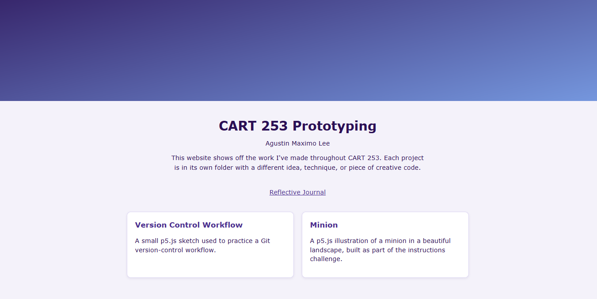
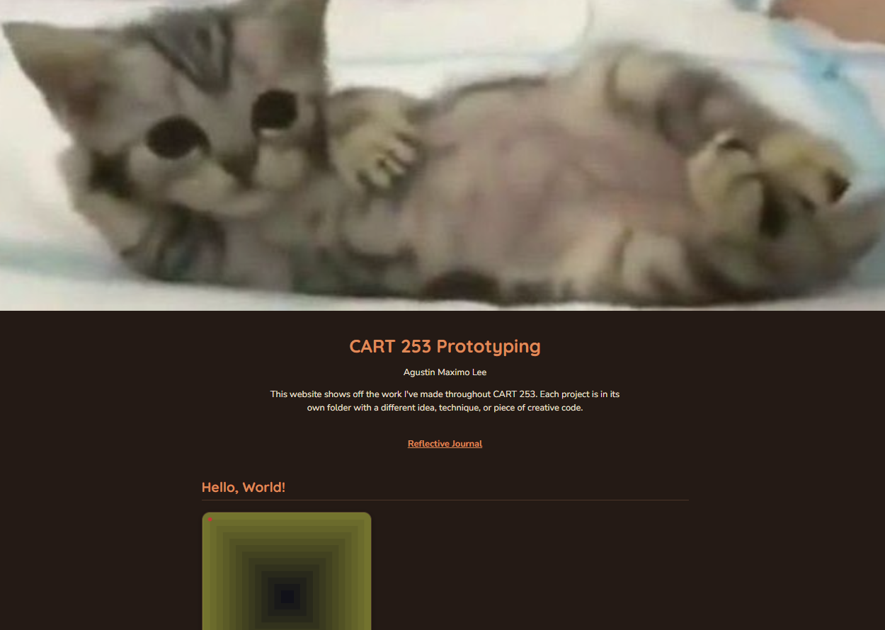

# Reflective Journal

## September 17, 2026

> I was surprised about using markdown. Honestly, I never realized what it was until recently. At first I thought it was some sort of terminal like git bash, later to find out its just a text based syntax like html. I quickly learned how it worked and how to get around with some of the syntax it has since its very similar (and simpler) than html. Embarrasing to admit that i never realized .md files meant markdown files.

> Github in the other hand was something I am familiar with: version control, commits, pushes, etc. The only thing im still unfamiliar with are branches and when many people work in a single repo and cause many conflicts... To my surprise, I really enjoyed Github Desktop by its simple UI and straightforward actions you can do; no need for git commands or git bash at all. (I was taught that using github desktop was bad).

> I really hope I can master markdown and p5 for many future projects! 

## September 24, 2026

> Working on these three prototypes honestly reminded me why I liked programming in the first place. Going back to the absolute basics was way more fun than I expected. I forgot how satisfying it is to build something from literally nothing, just messing around with shapes, colors, and variables until it starts looking like something.

> What surprised me the most is how much I ended up playing on my own. I only needed a couple of shapes, but I got so into it that I HAD TO put in arrays, different variables, random shape types, spinning/moving booleans, HSB color mode... way more than I really should have for something this simple. I just really started to think: "How can I make this work?, Whats a better way to do it?". Looking back, that's honestly a good sign (right?). 

> The hardest part wasnt really the p5 functions themselves, it was re-learning how to think through a problem step by step instead of jumping straight to an answer. Its been a really long time since I built something from scratch like this. Embarrassing to admit, but Ive gotten so used to already having AI and examples to start from and to help me debug. Just starting with a "blank" file felt... kinda scary at first.

